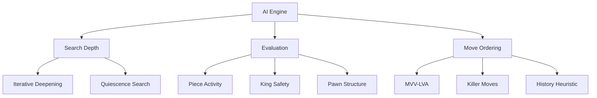

# Chess Bot - Phase 4: Advanced AI & Optimization

## Objectives
1. Enhance AI performance and decision making
2. Optimize code for better performance
3. Add AI vs AI mode for testing

## Implementation Plan

### 1. AI Engine Enhancements

#### A. Search Improvements
- Implement iterative deepening (start shallow, progressively go deeper)
- Add quiescence search for better tactical evaluation
- Add time management to handle variable search depths
- Optimize alpha-beta pruning with better move ordering

#### B. Enhanced Position Evaluation
- Add piece activity evaluation (mobility, center control)
- Implement king safety evaluation
- Add pawn structure analysis
  - Isolated pawns
  - Doubled pawns
  - Passed pawns
- Consider piece coordination

#### C. Move Ordering Optimization
- Implement MVV-LVA (Most Valuable Victim - Least Valuable Attacker)
- Add killer move heuristic
- Implement history heuristic for move ordering

### 2. Performance Optimization
- Profile code to identify bottlenecks
- Optimize board representation
- Cache frequently accessed data
- Implement transposition table
- Optimize move generation

### 3. AI vs AI Mode
- Add command-line option for AI vs AI games
- Implement game statistics collection
  - Number of moves
  - Time per move
  - Average evaluation
  - Opening choices
- Add logging capability for game analysis

### 4. Testing & Refinement
- Create test suite for AI performance
- Benchmark against different configurations
- Fine-tune evaluation parameters
- Test and document performance improvements

## Development Steps

1. **Stage 1: Search Enhancements**
   - Implement iterative deepening
   - Add quiescence search
   - Add time management
   - Test search improvements

2. **Stage 2: Evaluation Improvements**
   - Enhance position evaluation
   - Add piece activity scoring
   - Implement king safety
   - Add pawn structure analysis

3. **Stage 3: Move Ordering**
   - Implement MVV-LVA
   - Add killer moves
   - Add history heuristic
   - Test and tune move ordering

4. **Stage 4: Performance**
   - Profile code
   - Optimize critical paths
   - Implement caching
   - Add transposition table

5. **Stage 5: AI vs AI**
   - Add AI vs AI mode
   - Implement statistics
   - Add logging
   - Test different configurations

## Success Criteria
1. AI should make more strategic decisions
2. Search depth should be at least 4-ply
3. Move calculation should be faster
4. AI vs AI games should demonstrate reasonable play