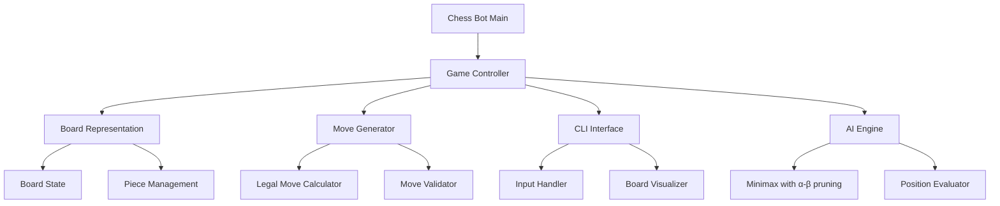

# Chess Bot Implementation Plan

## Architecture


## Project Structure
```
chess_bot/
├── src/
│   ├── __init__.py
│   ├── main.py
│   ├── board.py
│   ├── pieces.py
│   ├── move_generator.py
│   ├── ai_engine.py
│   ├── game_controller.py
│   └── cli.py
├── tests/
│   └── test_*.py
├── README.md
└── requirements.txt
```

## Development Phases

### Phase 1: Basic Board Setup & Movement
- Set up project structure
- Basic board representation (8x8)
- Simple piece movement (pawns and rooks only)
- Basic CLI visualization
- Move input handling
- Basic unit tests for board and pieces

### Phase 2: Complete Chess Rules
- Add remaining pieces (knights, bishops, queen, king)
- Implement check detection
- Add special rules (castling, en passant, promotion)
- Improve CLI visualization
- Add game state display
- Additional unit tests for new pieces

### Phase 3: Basic AI & Game Flow
- Simple minimax (depth 2)
- Basic position evaluation
- Turn management
- Win/loss detection
- Error handling
- Integration tests

### Phase 4: Advanced AI & Optimization
- Alpha-beta pruning
- Deeper search depths
- Improved evaluation function
- Move ordering
- Performance optimization
- AI vs AI mode

### Phase 5: Refinement & Polish
- Bug fixes
- Code cleanup
- Performance testing
- Documentation
- Final testing

## Technical Requirements
- Python 3.8+
- Command Line Interface
- Basic move input format (e.g., "e2e4")
- ASCII/Unicode board visualization
- AI using minimax with alpha-beta pruning
- Support for both human vs AI and AI vs AI modes

## Features
1. Board representation and visualization
2. Legal move generation and validation
3. Basic CLI with move input in e2e4 format
4. AI opponent using minimax with alpha-beta pruning
5. Game state tracking (check, checkmate, stalemate)
6. Support for all standard chess rules